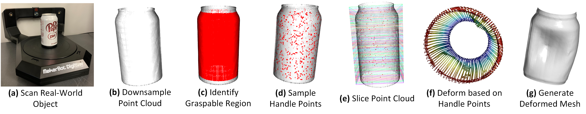
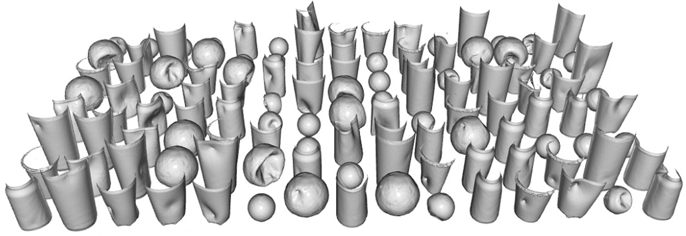
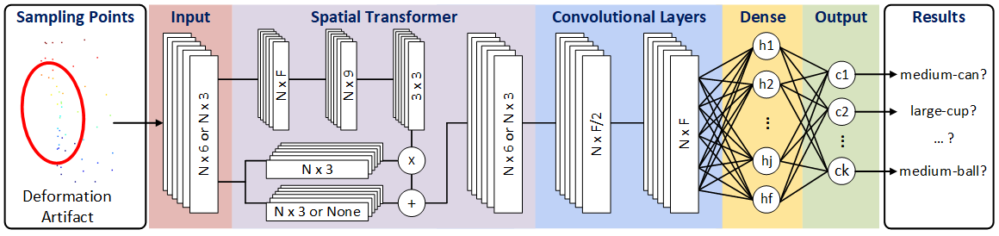
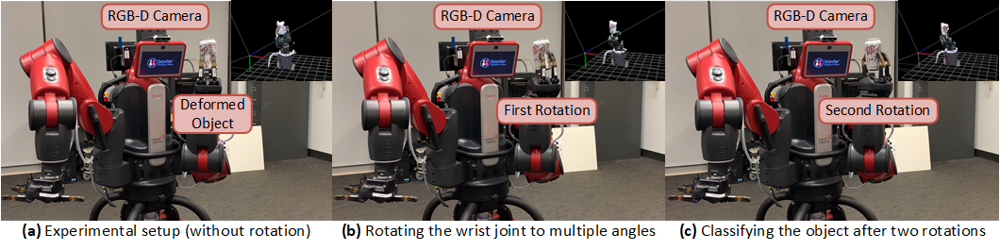

<!-- PAPER TITLE -->

# [ISR '23] Online 3D Deformable Object Classification for Mobile Cobot Manipulation

<!-- TABLE OF CONTENTS -->

<details>
  <summary>Table of Contents</summary>
  <ol>
    <li><a href="#authors">Authors</a></li>
    <li><a href="#abstract">Abstract</a></li>
    <li><a href="#prerequisites">Prerequisites</a></li>
    <li><a href="#3d-deformable-object-generation">3D Deformable Object Generation</a></li>
    <li><a href="#3d-deformable-object-classification">3D Deformable Object Classification</a></li>
    <li><a href="#online-deformable-object-classification-on-baxter-robot">Online Deformable Object Classification on Baxter Robot</a></li>
    <li><a href="#citing">Citing</a></li>
  </ol>
</details>

## Authors

<ol>
    <li><a href="https://mkhangg.com/">Khang Nguyen</a></li>
    <li><a href="https://www.tuandang.info/">Tuan Dang</a></li>
    <li><a href="https://www.uta.edu/academics/faculty/profile?username=huber">Manfred Huber</a></li>
</ol>

>  All authors are with Learning and Adaptive Robotics Laboratory, Department of Computer Science and Engineering, University of Texas at Arlington, Arlington, TX 76013, USA.

<!-- ABSTRACT -->

## Abstract

Vision-based object manipulation in assistive mobile cobots essentially relies on classifying the target objects based on their 3D shapes and features, whether they are deformed or not. In this work, we present an auto-generated dataset of deformed objects specific for assistive mobile cobot manipulation by utilizing intuitive Laplacian-based mesh deformation. We first determine the graspable region of the robot hand on the given object's mesh. Then, we uniformly sample handle points within the graspable region and perform deformation with multiple handle points based on the robot gripper configuration. In each deformation, we also identify the orientation of handle points and prevent self-intersection to guarantee the object's physical meaning when multiple handle points are simultaneously applied to the object's mesh at different deformation intensities. Finally, we test our generated dataset on the Baxter robot with two 7-DOF arms, an integrated RGB-D camera, and a 3D deformable object classifier. The result shows that the robot is able to classify real-world deformed objects from point clouds captured at multiple views by the RGB-D camera. The demo is available at [YouTube](https://youtu.be/qkgi3T6xYzI).

<p align="center">
   <br/>
 </p>

<!-- PREREQUISITES -->

## Prerequisites

* [Open3D](https://github.com/isl-org/Open3D) (version 0.16.0)
* [PyTorch](https://github.com/pytorch/pytorch) (version 2.0.0)
* [PyTorch3D](https://github.com/facebookresearch/pytorch3d) (version 0.7.3)

<!-- 3D DEFORMABLE OBJECT GENERATION -->

## 3D Deformable Object Generation

The deformation procedure includes **(a)** scanning real-world objects, **(b)** voxel downsampling the scanned point cloud, **(c)** identifying the graspable region of the robot on the point cloud, **(d)** sampling the handle points, **(e)** slicing the point cloud, **(f)** performing deformation on handle points based on robot gripper's configuration, and **(g)** generating the deformed mesh. All the source code for the deformation procedure is in [generator](/generator) folder.

<p align="center">
   <br/>
   <i>Mesh Deformation Procedure</i>
 </p>

Our dataset is generated on the Intel Core i7-12700K CPU, taking approximately 23 to 28 minutes for each class. Each class contains roughly 1,600 to 2,000 deformed meshes. The dataset can be found in [Google Drive](https://drive.google.com/drive/folders/1h-gVNTIZi-9tywnBu0xEvDDO39CltIUX?usp=sharing) folder.

<p align="center">
   <br/>
   <i>Demonstration of a subset of the auto-generated 3D deformable object dataset.</i>
 </p>
<!-- 3D DEFORMABLE OBJECT CLASSIFICATION -->

## 3D Deformable Object Classification

The input layer takes the input size of $N \times 3$ or $N \times 6$, where $N$ is the number of sampling points from the downsampled point cloud of $n$ points ($n \gg N$). Note that the input size depends on whether the input contains normal vectors or not. The model then passes the input to the spatial transformer network to embed spatial information that is invariant to permutations, rotations, and translations in point clouds. Then, the spatial features are multiplied with the points coordinates $N \times 3$ and re-appended to the normal vector coordinates if needed. Next, two convolutional layers are applied to the input embedded with spatial feature information to extract $F$ features for each input, which results in the size of $N \times F$. Thus, the feature maps are flattened to a fully-connected layer and return the classes' probabilities at the output layer. 

<p align="center">
   <br/>
   <i>Architecture of the 3D deformable object classification network.</i>
 </p>

## Online Deformable Object Classification on Baxter Robot

We first mount the Intel RealSense D435i RGB-D camera on the display of the Baxter robot. We then let the Baxter robot grasp one of the deformed objects (cans, cups, and balls) in the dataset using its hand gripper. The Baxter robot rotates its wrist to take point clouds at multiple angles. Finally, the Baxter robot classifies the object after taking the region of interest (ROI) of the registration of multiview point clouds. All the source code for the deployment procedure is in [deployment/main_pc](/deployment/main_pc) and [deployment/base_pc](/deployment/base_pc) folders.

<p align="center">
   <br/>
   <i>(a) Experimental setup for the Baxter robot grasping a deformed object (a deformed can), (b) rotating the wrist joint to take multiview point clouds, and (c) classifying the deformed object using the 3D classifier operating on onboard Intel GPU.</i>
 </p>

## Citing

```
@inproceedings{nguyen2023online,
  title={Online 3D Deformable Object Classification for Mobile Cobot Manipulation},
  author={Nguyen, Khang and Dang, Tuan and Huber, Manfred},
  booktitle={ISR Europe 2023; 56th International Symposium on Robotics},
  pages={139--146},
  year={2023},
  organization={VDE}
}
```
